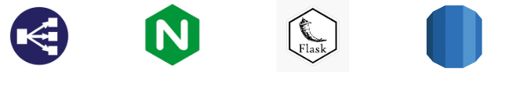

# Webapp

## Architecture Diagram



## Aplication Details
Simple API microservice which have nginx as frontend app and passes traffic to flask app which will store name and email to the backend RDS database

## Configuration Details
Application incudes deployments for nginx and flask API. Flask API will store data in RDS MySQL database. 
Used HPA for nginx and flask apps to autoscale and minimize downtime. 
Resource limits have been set in the deployments.
Used Secrets to store creds and ConfigMaps for storing configuration details. 
Used Helm for package management and the code can be reused for different environments like production, staging, dev etc..
Used Production, staging and dev as roles in ansible and the roles will be using the helm chart template and the perticular values.yaml can be used for change values.
Flask docker image have been build adn pushed to dockerhub for using in this application.
For better monitoring and managing, we can add helm charts like prometheus, grafana etc.. 
As there are different strategies for rolling updates, I would suggest canary strategy as it is been implimented gradually to full infra, for that we can use service mesh like istio.

## Tools Used

- Ansible for configuration management and automation
- Helm for package management
- kubernetes for container orchestration

## Installation

```bash
➜  ansible-playbook deploy.yml 
```

## Usage
Use curl for accessing the api like below give example or acess UI for seeing all the stored details via laodbalancer IP

**Note:** Use appropirate RDS or any other database details in values.yaml

```bash
➜  curl -H "Content-Type: application/json" -d '{"name": "<name>", "email": "<email>" }' http://<Loadbalancer IP>/create -vvv
*   Trying 172.x.x.x:80...
* Connected to 172.x.x.81 (172.x.x.81) port 80 (#0)
> POST /create HTTP/1.1
> Host: 172.x.x.81
> User-Agent: curl/7.71.1-DEV
> Accept: */*
> Content-Type: application/json
> Content-Length: 49
> 
* HTTP 1.0, assume close after body
< HTTP/1.0 200 OK
< Content-Type: application/json
< Content-Length: 29
< Access-Control-Allow-Origin: *
< Server: Werkzeug/2.0.3 Python/3.6.15
< Date: Mon, 15 Jan 2024 13:28:30 GMT
< 
"User created successfully!"
* Closing connection 0
```
## File Structure

```bash
.
├── deploy.yml
├── helm_charts
│   └── webapp
│       ├── Chart.yaml
│       ├── charts
│       ├── files
│       │   └── docker
│       │       └── flaskapi
│       │           ├── Dockerfile
│       │           ├── flaskapi.py
│       │           └── requirements.txt
│       └── templates
│           ├── flaskapp-deployment.yaml
│           ├── flaskapp-service.yaml
│           ├── flaskapp_configmap.yaml
│           ├── flaskapp_hpa.yaml
│           ├── flaskapp_secrets.yaml
│           ├── frontend_configmap.yaml
│           ├── frontend_deployemnt.yaml
│           ├── frontend_hpa.yaml
│           └── loadbalancer.yaml
└── roles
    ├── dev
    │   ├── files
    │   │   └── values.yaml
    │   └── tasks
    │       └── main.yml
    ├── production
    │   ├── files
    │   │   └── values.yaml
    │   └── tasks
    │       └── main.yml
    └── staging
        ├── files
        │   └── values.yaml
        └── tasks
            └── main.yml
```